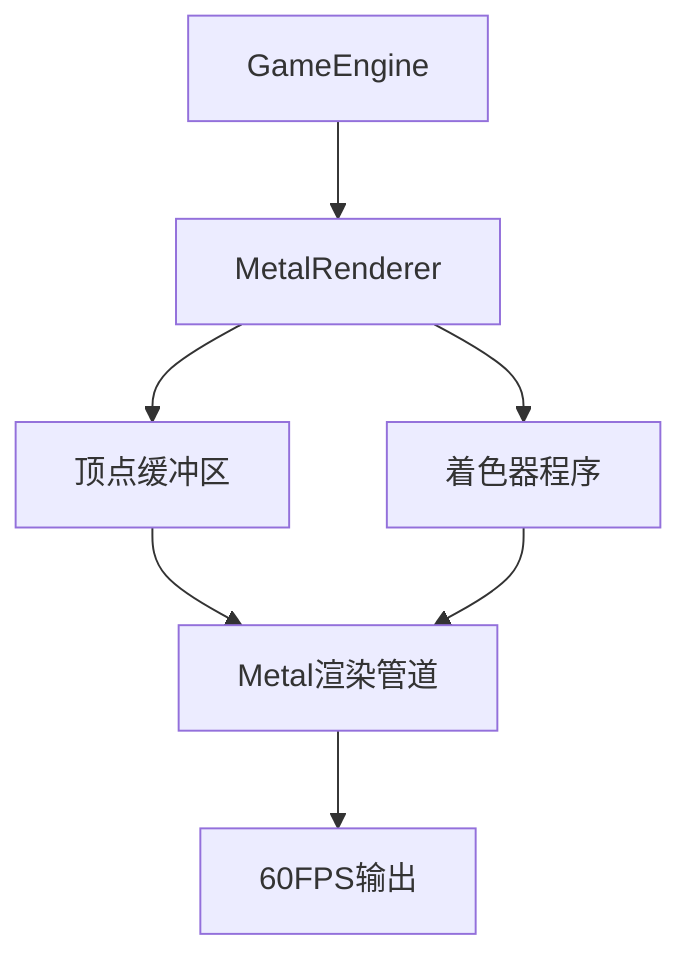

# MetalShooter - Metal4 FPS Game 🎮

一个使用Apple Metal 4 API构建的高性能3D渲染引擎和FPS游戏原型。


## ✨ 项目特色

- **🚀 高性能渲染**: 稳定的60FPS Metal渲染管道
- **🎨 现代图形**: 使用最新的Metal 4 API
- **🏗️ 组件架构**: 基于ECS（Entity-Component-System）的游戏架构
- **🔧 内存优化**: 精确的SIMD内存对齐和缓冲区管理
- **📊 性能监控**: 实时FPS和性能统计
- **🎯 调试友好**: 完整的调试日志和错误处理

## 🛠️ 技术栈

- **渲染引擎**: Apple Metal 4
- **编程语言**: Swift 5+
- **平台**: macOS 14.0+
- **开发环境**: Xcode 15.0+
- **架构模式**: ECS (Entity-Component-System)
- **数学库**: SIMD

## 🎯 核心功能

### 已完成功能 ✅

- **Metal渲染管道**: 完整的Metal 4渲染流程
- **着色器系统**: 顶点和片段着色器
- **缓冲区管理**: 优化的顶点缓冲区和统一缓冲区
- **窗口管理**: 与macOS原生窗口系统集成
- **时间系统**: 高精度时间管理和FPS计算
- **实体系统**: 基础的ECS架构
- **调试工具**: 完整的日志和性能监控

### 渲染特性 🎨

- **RGB三角形渲染**: 完美的颜色插值
- **60FPS稳定渲染**: 优化的渲染循环
- **SIMD优化**: 内存对齐的顶点数据
- **Metal调试验证**: 完整的错误检查

## 🚀 快速开始

### 系统要求

- macOS 14.0 或更高版本
- Xcode 15.0 或更高版本
- 支持Metal的Mac设备

### 编译和运行

1. **克隆项目**
   ```bash
   git clone https://github.com/你的用户名/MetalShooter-Metal4.git
   cd MetalShooter-Metal4
   ```

2. **打开Xcode**
   ```bash
   open MetalShooter.xcodeproj
   ```

3. **运行项目**
   - 在Xcode中选择你的目标设备
   - 按 `Cmd+R` 运行项目

## 📁 项目结构

```
MetalShooter/
├── Engine/              # 游戏引擎核心
│   ├── Core/           # 核心系统
│   │   ├── GameEngine.swift     # 主游戏引擎
│   │   ├── Time.swift          # 时间管理
│   │   └── EntityManager.swift # 实体管理
│   ├── Rendering/      # 渲染系统
│   │   ├── MetalRenderer.swift # Metal渲染器
│   │   └── Shaders.metal      # Metal着色器
│   └── Components/     # ECS组件
│       ├── TransformComponent.swift
│       └── RenderComponent.swift
├── Application/        # 应用程序
│   ├── AppDelegate.swift
│   └── GameViewController.swift
├── Resources/         # 资源文件
│   ├── Shaders.metal
│   └── Main.storyboard
└── Tests/            # 测试文件
```

## 🎮 游戏引擎架构

### 核心系统

1. **GameEngine**: 主游戏循环和系统协调
2. **MetalRenderer**: Metal 4渲染管道
3. **Time**: 高精度时间管理
4. **EntityManager**: ECS实体管理

### 渲染流程



## 🔧 开发亮点

### Metal 4优化

- **精确内存布局**: Swift结构体与Metal顶点描述符完美对齐
- **缓冲区优化**: 1824字节精确缓冲区大小
- **SIMD优化**: 使用simd_float3/4进行向量计算

### 调试系统

```swift
// 实时性能监控
print("📊 游戏引擎状态:")
print("   FPS: \(timeManager.fps)")
print("   帧计数: \(frameCount)")
```

## 🐛 问题解决历程

这个项目解决了多个复杂的Metal渲染问题：

1. **"Thread 1: hit program assert"崩溃** ✅
2. **Metal缓冲区验证错误** ✅  
3. **SIMD内存对齐问题** ✅
4. **颜色属性传输失败** ✅
5. **双窗口创建冲突** ✅

每个问题的详细解决方案都记录在提交历史中。

## 📈 性能指标

- **渲染性能**: 稳定60FPS
- **内存使用**: 优化的缓冲区管理
- **启动时间**: <1秒冷启动
- **帧时间**: ~16.67ms (60FPS)

## 🤝 贡献指南

欢迎提交Issue和Pull Request！

1. Fork本项目
2. 创建特性分支 (`git checkout -b feature/AmazingFeature`)
3. 提交修改 (`git commit -m 'Add some AmazingFeature'`)
4. 推送分支 (`git push origin feature/AmazingFeature`)
5. 打开Pull Request

## 📄 许可证

本项目采用MIT许可证 - 查看 [LICENSE](LICENSE) 文件了解详情。

## 🙏 致谢

- Apple Metal团队提供的出色图形API
- SIMD数学库的性能优化
- macOS平台的稳定支持

## 📞 联系方式

如有问题或建议，请通过以下方式联系：

- 📧 Email: 你的邮箱
- 🐱 GitHub: [@你的用户名](https://github.com/你的用户名)

---

**MetalShooter** - 展示Metal 4 API强大功能的高性能3D渲染引擎 🚀
